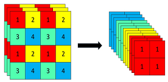
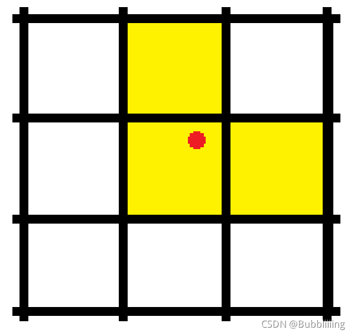
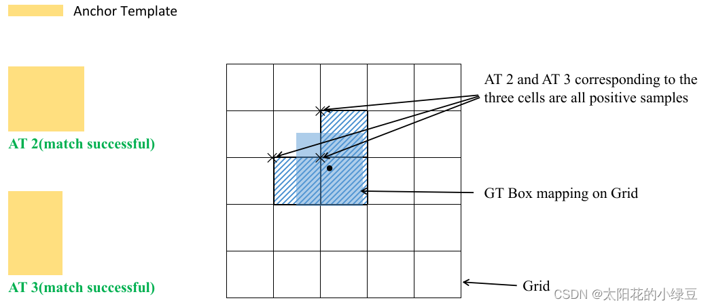
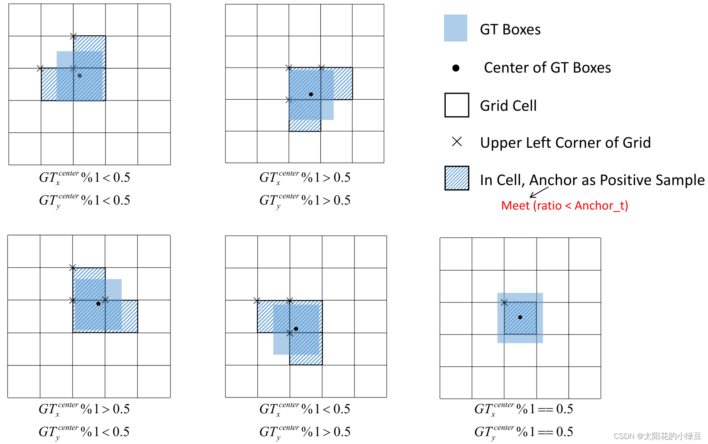
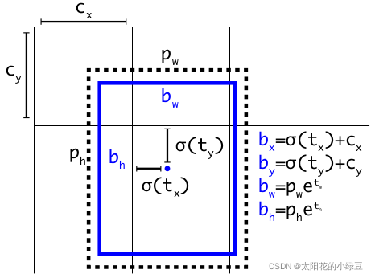
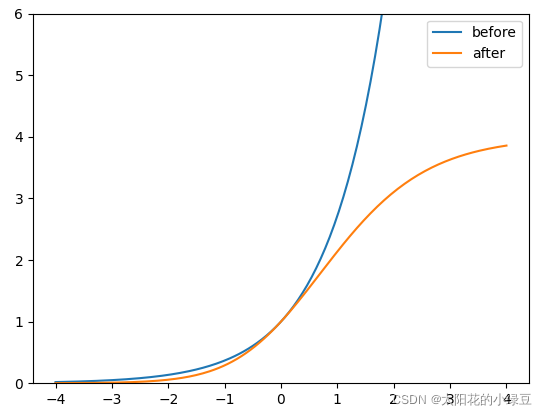

https://blog.csdn.net/weixin_44791964/article/details/121626848

# 学习前言

这个很久都没有学，最终还是决定看看，复现的是[YoloV5](https://so.csdn.net/so/search?q=YoloV5&spm=1001.2101.3001.7020)的第5版，V5有好多版本在，作者也一直在更新，我选了这个时间的倒数第二个版本。

# 源码下载

https://github.com/bubbliiiing/yolov5-pytorch
喜欢的可以点个star噢。

# YoloV5改进的部分（不完全）

**1、主干部分：使用了Focus网络结构，具体操作是在一张图片中每隔一个像素拿到一个值，这个时候获得了四个独立的特征层，然后将四个独立的特征层进行堆叠，此时宽高信息就集中到了通道信息，输入通道扩充了四倍**。**该结构在YoloV5第5版之前有所应用，最新版本中未使用。**

**2、数据增强：Mosaic数据增强、Mosaic利用了四张图片进行拼接实现数据中增强，根据论文所说其拥有一个巨大的优点是丰富检测物体的背景！且在BN计算的时候一下子会计算四张图片的数据！**

**3、多正样本匹配：在之前的Yolo系列里面，在训练时每一个真实框对应一个正样本，即在训练时，每一个真实框仅由一个先验框负责预测。YoloV5中为了加快模型的训练效率，增加了正样本的数量，在训练时，每一个真实框可以由多个先验框负责预测。**

**以上并非全部的改进部分，还存在一些其它的改进，这里只列出来了一些我比较感兴趣，而且非常有效的改进。**

# YoloV5实现思路

## 一、整体结构解析


在学习YoloV5之前，我们需要对YoloV5所作的工作有一定的了解，这有助于我们后面去了解网络的细节。

**和之前版本的Yolo类似，整个YoloV5可以依然可以分为三个部分，分别是Backbone，FPN以及Yolo Head**。

**Backbone可以被称作YoloV5的主干特征提取网络**，**根据它的结构以及之前Yolo主干的叫法，我一般叫它CSPDarknet**，输入的图片首先会在CSPDarknet里面进行**特征提取**，提取到的特征可以被称作特征层，**是输入图片的特征集合**。在主干部分，我们**获取了三个特征层**进行下一步网络的构建，这三个特征层我称它为**有效特征层**。

**FPN可以被称作YoloV5的加强特征提取网络**，在主干部分获得的三个**有效特征层**会在这一部分进行特征融合，特征融合的目的是结合不同尺度的特征信息。在FPN部分，已经获得的**有效特征层**被用于继续提取特征。**在YoloV5里依然使用到了Panet的结构，我们不仅会对特征进行上采样实现特征融合，还会对特征再次进行下采样实现特征融合。**

**Yolo Head是YoloV5的分类器与回归器**，通过CSPDarknet和FPN，我们已经可以获得三个加强过的有效特征层。每一个特征层都有宽、高和通道数，此时我们可以将**特征图看作一个又一个特征点的集合**，**每一个特征点都有通道数个特征**。Yolo Head实际上所做的工作就是**对特征点进行判断**，判断**特征点是否有物体与其对应**。与以前版本的Yolo一样，YoloV5所用的解耦头是一起的，也就是分类和回归在一个1X1卷积里实现。

因此，整个YoloV5网络所作的工作就是 **特征提取-特征加强-预测特征点对应的物体情况**。

## 二、网络结构解析

### 1、主干网络Backbone介绍


YoloV5所使用的主干特征提取网络为CSPDarknet，它具有五个重要特点：

1、使用了**残差网络Residual**，CSPDarknet中的残差卷积可以分为两个部分，主干部分是一次1X1的卷积和一次3X3的卷积；残差边部分不做任何处理，直接将主干的输入与输出结合。**整个YoloV5的主干部分都由残差卷积构成**：

```python
#--------------------------------------------------#
#   残差结构的构建，小的残差结构
#   在这里通道和宽高都不变
#   两层卷积 1x1和3x3
#--------------------------------------------------#
class Bottleneck(nn.Module):
    # Standard bottleneck
    def __init__(self, c1, c2, shortcut=True, g=1, e=0.5):  # ch_in, ch_out, shortcut, groups, expansion
        super().__init__()
        c_ = int(c2 * e)  # hidden channels
        #--------------------------------------------------#
        #   利用1x1卷积进行通道数的缩减。缩减率一般是50%
        #--------------------------------------------------#
        self.cv1 = Conv(c1, c_, 1, 1)
        #--------------------------------------------------#
        #   利用3x3卷积进行通道数的拓张。并且完成特征提取
        #--------------------------------------------------#
        self.cv2 = Conv(c_, c2, 3, 1, g=g)
        # 只有使用残差且 in_channels == out_channels 时才使用残差模块
        self.add = shortcut and c1 == c2

    def forward(self, x):
        return x + self.cv2(self.cv1(x)) if self.add else self.cv2(self.cv1(x))
```


残差网络的特点是**容易优化**，并且能够通过增加相当的**深度来提高准确率**。其内部的**残差块使用了跳跃连接，缓解了在深度神经网络中增加深度带来的梯度消失问题。**

2、使用**CSPnet**网络结构，CSPnet结构并不算复杂，就是将原来的残差块的堆叠进行了一个拆分，拆成左右两部分：**主干部分继续进行原来的残差块的堆叠**；**另一部分则像一个残差边一样，经过少量处理直接连接到最后。\**因此可以认为\**CSP中存在一个大的残差边。**


```python
#--------------------------------------------------------------------#
#   CSPdarknet的结构块,每个stage的结构
#
#   CSPnet结构并不算复杂，就是将原来的残差块的堆叠进行了一个拆分，拆成左右两部分:
#   主干部分继续进行原来的残差块的堆叠；
#   另一部分则像一个残差边一样，经过少量处理直接连接到最后。
#   因此可以认为CSP中存在一个大的残差边。
#
#   V4中先进行了一次卷积让通道翻倍,宽高减半,这里没有做,而是分出去做了,直接就是分为两个分支了,所以最终宽高不变,维度也不变
#--------------------------------------------------------------------#
class C3(nn.Module):
    # CSP Bottleneck with 3 convolutions
    def __init__(self, c1, c2, n=1, shortcut=True, g=1, e=0.5):  # ch_in, ch_out, number, shortcut, groups, expansion
        super().__init__()
        # 两个分支中间维度缩减一半
        c_ = int(c2 * e)  # hidden channels

        #----------------------------------------#
        #   右侧
        #----------------------------------------#
        self.cv1 = Conv(c1, c_, 1, 1)
        #----------------------------------------#
        #   左侧
        #----------------------------------------#
        self.cv2 = Conv(c1, c_, 1, 1)
        #----------------------------------------#
        #   最终拼接
        #----------------------------------------#
        self.cv3 = Conv(2 * c_, c2, 1)  # act=FReLU(c2)
        #--------------------------------------------------#
        #   根据循环的次数构建上述Bottleneck残差结构
        #--------------------------------------------------#
        self.m = nn.Sequential(*[Bottleneck(c_, c_, shortcut, g, e=1.0) for _ in range(n)])
        # self.m = nn.Sequential(*[CrossConv(c_, c_, 3, 1, g, 1.0, shortcut) for _ in range(n)])

    def forward(self, x):
        #----------------------------------------#
        #   拼接两侧的输出
        #----------------------------------------#
        return self.cv3(torch.cat(
            (
                self.m(self.cv1(x)),
                self.cv2(x)
            )
            , dim=1))
```

3、使用了Focus网络结构，这个网络结构是在YoloV5里面使用到比较有趣的网络结构，具体操作是在一张图片中每隔一个像素拿到一个值，这个时候获得了四个独立的特征层，然后将四个独立的特征层进行堆叠，此时宽高信息就集中到了通道信息，输入通道扩充了四倍。拼接起来的特征层相对于原先的三通道变成了十二个通道，下图很好的展示了Focus结构，一看就能明白。



```python
#----------------------------------------#
#   Focus + 3x3Conv + bn + act
#   跳采样,堆叠,宽高减半,通道变为4倍
#----------------------------------------#
class Focus(nn.Module):
    def __init__(self, c1, c2, k=1, s=1, p=None, g=1, act=True):  # ch_in, ch_out, kernel, stride, padding, groups
        super().__init__()
        self.conv = Conv(c1 * 4, c2, k, s, p, g, act)

    def forward(self, x):
        # 320, 320, 12 => 320, 320, 64
        return self.conv(
            # 640, 640, 3 => 320, 320, 12
            torch.cat(
                [
                    x[..., ::2, ::2],   # ... 取前两个维度
                    x[..., 1::2, ::2],
                    x[..., ::2, 1::2],
                    x[..., 1::2, 1::2]
                ], 1
            )
        )
```

4、使用了SiLU激活函数，SiLU是Sigmoid和ReLU的改进版。SiLU具备无上界有下界、平滑、非单调的特性。SiLU在深层模型上的效果优于 ReLU。可以看做是平滑的ReLU激活函数。
$$
f(x)=x⋅sigmoid(x)
$$


```python
class SiLU(nn.Module):
    @staticmethod
    def forward(x):
        return x * torch.sigmoid(x)
```

5、使用了SPP结构，通过不同池化核大小的最大池化进行特征提取，提高网络的感受野。在YoloV4中，SPP是用在FPN里面的，在YoloV5中，SPP模块被用在了主干特征提取网络中。

```python
#---------------------------------------------------#
#   SPP结构，利用不同大小的池化核进行池化,增大感受野
#   池化后和输入数据进行维度堆叠
#   pool_sizes=[1, 5, 9, 13] 1不变,所以不用做了
#---------------------------------------------------#
class SPP(nn.Module):
    # Spatial pyramid pooling layer used in YOLOv3-SPP
    def __init__(self, c1, c2, k=(5, 9, 13)):
        super().__init__()
        c_ = c1 // 2  # hidden channels
        # 1x1Conv缩减通道
        self.cv1 = Conv(c1, c_, 1, 1)
        # 1x1Conv调整通道
        self.cv2 = Conv(c_ * (len(k) + 1), c2, 1, 1)
        #                                                   stride=1且有padding,所以最终大小不变
        self.m = nn.ModuleList([nn.MaxPool2d(kernel_size=x, stride=1, padding=x // 2) for x in k])
    def forward(self, x):
        x = self.cv1(x)
        return self.cv2(torch.cat([x] + [m(x) for m in self.m], 1))
```

整个主干实现代码为：

```python
from numpy import pad
import torch
import torch.nn as nn


class SiLU(nn.Module):
    @staticmethod
    def forward(x):
        return x * torch.sigmoid(x)

def autopad(k, p=None):
    if p is None:
        p = k // 2 if isinstance(k, int) else [x // 2 for x in k]
    return p

#----------------------------------------#
#   Focus + 3x3Conv + bn + act
#   跳采样,堆叠,宽高减半,通道变为4倍
#----------------------------------------#
class Focus(nn.Module):
    def __init__(self, c1, c2, k=1, s=1, p=None, g=1, act=True):  # ch_in, ch_out, kernel, stride, padding, groups
        super().__init__()
        self.conv = Conv(c1 * 4, c2, k, s, p, g, act)

    def forward(self, x):
        # 320, 320, 12 => 320, 320, 64
        return self.conv(
            # 640, 640, 3 => 320, 320, 12
            torch.cat(
                [
                    x[..., ::2, ::2],   # ... 取前两个维度
                    x[..., 1::2, ::2],
                    x[..., ::2, 1::2],
                    x[..., 1::2, 1::2]
                ], 1
            )
        )

#----------------------------------------#
#   Conv + bn + act
#----------------------------------------#
class Conv(nn.Module):
    def __init__(self, c1, c2, k=1, s=1, p=None, g=1, act=True):
        super().__init__()
        self.conv   = nn.Conv2d(c1, c2, k, s, autopad(k, p), groups=g, bias=False)
        self.bn     = nn.BatchNorm2d(c2, eps=0.001, momentum=0.03)
        self.act    = SiLU() if act is True else (act if isinstance(act, nn.Module) else nn.Identity())

    def forward(self, x):
        return self.act(self.bn(self.conv(x)))

    def fuseforward(self, x):
        return self.act(self.conv(x))

#--------------------------------------------------#
#   残差结构的构建，小的残差结构
#   在这里通道和宽高都不变
#   两层卷积 1x1和3x3
#--------------------------------------------------#
class Bottleneck(nn.Module):
    # Standard bottleneck
    def __init__(self, c1, c2, shortcut=True, g=1, e=0.5):  # ch_in, ch_out, shortcut, groups, expansion
        super().__init__()
        c_ = int(c2 * e)  # hidden channels
        #--------------------------------------------------#
        #   利用1x1卷积进行通道数的缩减。缩减率一般是50%
        #--------------------------------------------------#
        self.cv1 = Conv(c1, c_, 1, 1)
        #--------------------------------------------------#
        #   利用3x3卷积进行通道数的拓张。并且完成特征提取
        #--------------------------------------------------#
        self.cv2 = Conv(c_, c2, 3, 1, g=g)
        # 只有使用残差且 in_channels == out_channels 时才使用残差模块
        self.add = shortcut and c1 == c2

    def forward(self, x):
        return x + self.cv2(self.cv1(x)) if self.add else self.cv2(self.cv1(x))

#--------------------------------------------------------------------#
#   CSPdarknet的结构块,每个stage的结构
#
#   CSPnet结构并不算复杂，就是将原来的残差块的堆叠进行了一个拆分，拆成左右两部分:
#   主干部分继续进行原来的残差块的堆叠；
#   另一部分则像一个残差边一样，经过少量处理直接连接到最后。
#   因此可以认为CSP中存在一个大的残差边。
#
#   V4中先进行了一次卷积让通道翻倍,宽高减半,这里没有做,而是分出去做了,直接就是分为两个分支了,所以最终宽高不变,维度也不变
#--------------------------------------------------------------------#
class C3(nn.Module):
    # CSP Bottleneck with 3 convolutions
    def __init__(self, c1, c2, n=1, shortcut=True, g=1, e=0.5):  # ch_in, ch_out, number, shortcut, groups, expansion
        super().__init__()
        # 两个分支中间维度缩减一半
        c_ = int(c2 * e)  # hidden channels

        #----------------------------------------#
        #   右侧
        #----------------------------------------#
        self.cv1 = Conv(c1, c_, 1, 1)
        #----------------------------------------#
        #   左侧
        #----------------------------------------#
        self.cv2 = Conv(c1, c_, 1, 1)
        #----------------------------------------#
        #   最终拼接
        #----------------------------------------#
        self.cv3 = Conv(2 * c_, c2, 1)  # act=FReLU(c2)
        #--------------------------------------------------#
        #   根据循环的次数构建上述Bottleneck残差结构
        #--------------------------------------------------#
        self.m = nn.Sequential(*[Bottleneck(c_, c_, shortcut, g, e=1.0) for _ in range(n)])
        # self.m = nn.Sequential(*[CrossConv(c_, c_, 3, 1, g, 1.0, shortcut) for _ in range(n)])

    def forward(self, x):
        #----------------------------------------#
        #   拼接两侧的输出
        #----------------------------------------#
        return self.cv3(torch.cat(
            (
                self.m(self.cv1(x)),
                self.cv2(x)
            )
            , dim=1))

#---------------------------------------------------#
#   SPP结构，利用不同大小的池化核进行池化,增大感受野
#   池化后和输入数据进行维度堆叠
#   pool_sizes=[1, 5, 9, 13] 1不变,所以不用做了
#---------------------------------------------------#
class SPP(nn.Module):
    # Spatial pyramid pooling layer used in YOLOv3-SPP
    def __init__(self, c1, c2, k=(5, 9, 13)):
        super().__init__()
        c_ = c1 // 2  # hidden channels
        # 1x1Conv缩减通道
        self.cv1 = Conv(c1, c_, 1, 1)
        # 1x1Conv调整通道
        self.cv2 = Conv(c_ * (len(k) + 1), c2, 1, 1)
        #                                                   stride=1且有padding,所以最终大小不变
        self.m = nn.ModuleList([nn.MaxPool2d(kernel_size=x, stride=1, padding=x // 2) for x in k])
    def forward(self, x):
        x = self.cv1(x)
        return self.cv2(torch.cat([x] + [m(x) for m in self.m], 1))

class CSPDarknet(nn.Module):
    def __init__(self, base_channels, base_depth):
        super().__init__()
        #-----------------------------------------------#
        #   输入图片是640, 640, 3
        #   初始的基本通道base_channels是64
        #-----------------------------------------------#

        #-----------------------------------------------#
        #   利用focus网络结构进行特征提取
        #   640, 640, 3 -> 320, 320, 12 -> 320, 320, 64
        #-----------------------------------------------#
        self.stem       = Focus(3, base_channels, k=3)

        #-----------------------------------------------#
        #   完成卷积之后，320, 320, 64 -> 160, 160, 128
        #   完成CSPlayer之后，160, 160, 128 -> 160, 160, 128
        #-----------------------------------------------#
        self.dark2 = nn.Sequential(
            # 320, 320, 64 -> 160, 160, 128
            Conv(base_channels, base_channels * 2, 3, 2),
            # 160, 160, 128 -> 160, 160, 128
            C3(base_channels * 2, base_channels * 2, base_depth),
        )

        #-----------------------------------------------#
        #   完成卷积之后，160, 160, 128 -> 80, 80, 256
        #   完成CSPlayer之后，80, 80, 256 -> 80, 80, 256
        #                   在这里引出有效特征层80, 80, 256
        #                   进行加强特征提取网络FPN的构建
        #-----------------------------------------------#
        self.dark3 = nn.Sequential(
            Conv(base_channels * 2, base_channels * 4, 3, 2),
            C3(base_channels * 4, base_channels * 4, base_depth * 3),
        )

        #-----------------------------------------------#
        #   完成卷积之后，80, 80, 256 -> 40, 40, 512
        #   完成CSPlayer之后，40, 40, 512 -> 40, 40, 512
        #                   在这里引出有效特征层40, 40, 512
        #                   进行加强特征提取网络FPN的构建
        #-----------------------------------------------#
        self.dark4 = nn.Sequential(
            Conv(base_channels * 4, base_channels * 8, 3, 2),
            C3(base_channels * 8, base_channels * 8, base_depth * 3),
        )

        #-----------------------------------------------#
        #   完成卷积之后，40, 40, 512 -> 20, 20, 1024
        #   完成SPP之后，20, 20, 1024 -> 20, 20, 1024
        #   完成CSPlayer之后，20, 20, 1024 -> 20, 20, 1024
        #-----------------------------------------------#
        self.dark5 = nn.Sequential(
            Conv(base_channels * 8, base_channels * 16, 3, 2),
            SPP(base_channels * 16, base_channels * 16),
            C3(base_channels * 16, base_channels * 16, base_depth, shortcut=False),
        )

    def forward(self, x):
        x = self.stem(x)
        x = self.dark2(x)
        #-----------------------------------------------#
        #   dark3的输出为80, 80, 256，是一个有效特征层
        #-----------------------------------------------#
        x = self.dark3(x)
        feat1 = x
        #-----------------------------------------------#
        #   dark4的输出为40, 40, 512，是一个有效特征层
        #-----------------------------------------------#
        x = self.dark4(x)
        feat2 = x
        #-----------------------------------------------#
        #   dark5的输出为20, 20, 1024，是一个有效特征层
        #-----------------------------------------------#
        x = self.dark5(x)
        feat3 = x
        return feat1, feat2, feat3
```

### 2、构建FPN特征金字塔进行加强特征提取


在特征利用部分，YoloV5提取**多特征层进行目标检测**，一共**提取三个特征层**。

三个特征层位于主干部分CSPdarknet的不同位置，分别位于**中间层，中下层，底层**，当输入为(640,640,3)的时候，三个特征层的**shape分别为feat1=(80,80,256)、feat2=(40,40,512)、feat3=(20,20,1024)。**

在获得三个有效特征层后，我们利用这三个有效特征层进行FPN层的构建，构建方式为：

1. feat3=(20,20,1024)的特征层进行1次1X1卷积调整通道后获得P5，**P5进行上采样UmSampling2d后与feat2=(40,40,512)特征层进行结合**，然后使用CSPLayer进行特征提取获得P5_upsample，此时获得的特征层为(40,40,512)。

2. P5_upsample=(40,40,512)的特征层进行1次1X1卷积调整通道后获得P4，**P4进行上采样UmSampling2d后与feat1=(80,80,256)特征层进行结合**，然后使用CSPLayer进行特征提取P3_out，此时获得的特征层为(80,80,256)。
3. P3_out=(80,80,256)的特征层进行一次3x3卷积进行下采样，**下采样后与P4堆叠**，然后使用CSPLayer进行特征提取P4_out，此时获得的特征层为(40,40,512)。
4. P4_out=(40,40,512)的特征层进行一次3x3卷积进行下采样，**下采样后与P5堆叠**，然后使用CSPLayer进行特征提取P5_out，此时获得的特征层为(20,20,1024)。

特征金字塔可以将**不同shape的特征层进行特征融合**，有利于**提取出更好的特征**。

```python
import torch
import torch.nn as nn

from nets.CSPdarknet import CSPDarknet, C3, Conv

#---------------------------------------------------#
#   yolo_body
#---------------------------------------------------#
class YoloBody(nn.Module):
    def __init__(self, anchors_mask, num_classes, phi):
        super(YoloBody, self).__init__()
        depth_dict          = {'s' : 0.33, 'm' : 0.67, 'l' : 1.00, 'x' : 1.33,}
        width_dict          = {'s' : 0.50, 'm' : 0.75, 'l' : 1.00, 'x' : 1.25,}
        dep_mul, wid_mul    = depth_dict[phi], width_dict[phi]

        base_channels       = int(wid_mul * 64)  # 64
        base_depth          = max(round(dep_mul * 3), 1)  # 3
        #-----------------------------------------------#
        #   输入图片是640, 640, 3
        #   初始的基本通道是64
        #-----------------------------------------------#

        #---------------------------------------------------#
        #   生成CSPdarknet53的主干模型
        #   获得三个有效特征层，他们的shape分别是：
        #   80,80,256
        #   40,40,512
        #   20,20,1024
        #---------------------------------------------------#
        self.backbone   = CSPDarknet(base_channels, base_depth)

        #-------------------------------------------#
        #   上采样,宽高x2
        #-------------------------------------------#
        self.upsample   = nn.Upsample(scale_factor=2, mode="nearest")

        #-------------------------------------------#
        #   P5开始的的1x1Conv,得到 P5
        #   20, 20, 1024 -> 20, 20, 512
        #-------------------------------------------#
        self.conv_for_feat3         = Conv(base_channels * 16, base_channels * 8, 1, 1)
        #-------------------------------------------#
        #   P5_upsample,feat2 拼接之后的 CSPLayer
        #   40, 40, 1024 -> 40, 40, 512
        #-------------------------------------------#
        self.conv3_for_upsample1    = C3(base_channels * 16, base_channels * 8, base_depth, shortcut=False)

        #-------------------------------------------#
        #   拼接 P5_upsample,feat2 后的CSPLayer的1x1Conv,得到P4
        #   40, 40, 512 -> 40, 40, 256
        #-------------------------------------------#
        self.conv_for_feat2         = Conv(base_channels * 8, base_channels * 4, 1, 1)
        #-------------------------------------------#
        #   拼接 P4_upsample,feat1 后的 CPSLayer,得到 P3_out
        #   80, 80, 512 -> 80, 80, 256
        #-------------------------------------------#
        self.conv3_for_upsample2    = C3(base_channels * 8, base_channels * 4, base_depth, shortcut=False)

        #-------------------------------------------#
        #   P3_out下采样
        #   80, 80, 256 -> 40, 40, 256
        #-------------------------------------------#
        self.down_sample1           = Conv(base_channels * 4, base_channels * 4, 3, 2)
        #-------------------------------------------#
        #   拼接 P3_downsample, P4 后的 CPSLayer,得到 P4_out
        #   40, 40, 512 -> 40, 40, 512
        #-------------------------------------------#
        self.conv3_for_downsample1  = C3(base_channels * 8, base_channels * 8, base_depth, shortcut=False)

        #-------------------------------------------#
        #   P4_out下采样
        #   40, 40, 512 -> 20, 20, 512
        #-------------------------------------------#
        self.down_sample2           = Conv(base_channels * 8, base_channels * 8, 3, 2)
        #-------------------------------------------#
        #   拼接 P4_downsample, P5 后的 CPSLayer,得到 P5_out
        #   20, 20, 1024 -> 20, 20, 1024
        #-------------------------------------------#
        self.conv3_for_downsample2  = C3(base_channels * 16, base_channels * 16, base_depth, shortcut=False)


        #-------------------------------------------#
        #   yolo_head
        #   3个1x1Conv
        #-------------------------------------------#
        # 80, 80, 256 => 80, 80, 3 * (5 + num_classes) => 80, 80, 3 * (4 + 1 + num_classes)
        self.yolo_head_P3 = nn.Conv2d(base_channels * 4, len(anchors_mask[2]) * (5 + num_classes), 1)
        # 40, 40, 512 => 40, 40, 3 * (5 + num_classes) => 40, 40, 3 * (4 + 1 + num_classes)
        self.yolo_head_P4 = nn.Conv2d(base_channels * 8, len(anchors_mask[1]) * (5 + num_classes), 1)
        # 20, 20, 1024 => 20, 20, 3 * (5 + num_classes) => 20, 20, 3 * (4 + 1 + num_classes)
        self.yolo_head_P5 = nn.Conv2d(base_channels * 16, len(anchors_mask[0]) * (5 + num_classes), 1)

    def forward(self, x):
        #-------------------------------------------#
        #   feat1: 80, 80, 256
        #   feat2: 40, 40, 512
        #   feat3: 20, 20, 1024
        #-------------------------------------------#
        feat1, feat2, feat3 = self.backbone(x)

        """第一次上采样"""
        #-------------------------------------------#
        #   P5开始的的1x1Conv,得到 P5
        #   20, 20, 1024 -> 20, 20, 512
        #-------------------------------------------#
        P5          = self.conv_for_feat3(feat3)
        #-------------------------------------------#
        #   P5上采样
        #   20, 20, 512 -> 40, 40, 512
        #-------------------------------------------#
        P5_upsample = self.upsample(P5)
        #-------------------------------------------#
        #   拼接 P5_upsample,feat2
        #   40, 40, 512 + 40, 40, 512 -> 40, 40, 1024
        #-------------------------------------------#
        P5_upsample = torch.cat([P5_upsample, feat2], 1)
        #-------------------------------------------#
        #   P5_upsample,feat2 拼接之后的CSPLayer
        #   40, 40, 1024 -> 40, 40, 512
        #-------------------------------------------#
        P5_upsample = self.conv3_for_upsample1(P5_upsample)

        """第二次上采样"""
        #-------------------------------------------#
        #   拼接 P5_upsample,feat2 后的CSPLayer的1x1Conv,得到P4
        #   40, 40, 512 -> 40, 40, 256
        #-------------------------------------------#
        P4          = self.conv_for_feat2(P5_upsample)
        #-------------------------------------------#
        #   P4的上采样
        #   40, 40, 256 -> 80, 80, 256
        #-------------------------------------------#
        P4_upsample = self.upsample(P4)
        #-------------------------------------------#
        #   拼接 P4_upsample,feat1
        #   80, 80, 256 + 80, 80, 256 -> 80, 80, 512
        #-------------------------------------------#
        P4_upsample  = torch.cat([P4_upsample, feat1], 1)
        #-------------------------------------------#
        #   拼接 P4_upsample,feat1 后的 CPSLayer,得到 P3_out
        #   80, 80, 512 -> 80, 80, 256
        #-------------------------------------------#
        P3_out       = self.conv3_for_upsample2(P4_upsample)

        """第一次下采样"""
        #-------------------------------------------#
        #   P3_out下采样
        #   80, 80, 256 -> 40, 40, 256
        #-------------------------------------------#
        P3_downsample = self.down_sample1(P3_out)
        #-------------------------------------------#
        #   拼接 P3_downsample, P4
        #   40, 40, 256 + 40, 40, 256 -> 40, 40, 512
        #-------------------------------------------#
        P3_downsample = torch.cat([P3_downsample, P4], 1)
        #-------------------------------------------#
        #   拼接 P3_downsample, P4 后的 CPSLayer,得到 P4_out
        #   40, 40, 512 -> 40, 40, 512
        #-------------------------------------------#
        P4_out        = self.conv3_for_downsample1(P3_downsample)

        """第二次下采样"""
        #-------------------------------------------#
        #   P4_out下采样
        #   40, 40, 512 -> 20, 20, 512
        #-------------------------------------------#
        P4_downsample = self.down_sample2(P4_out)
        #-------------------------------------------#
        #   拼接 P4_downsample, P5
        #   20, 20, 512 + 20, 20, 512 -> 20, 20, 1024
        #-------------------------------------------#
        P4_downsample = torch.cat([P4_downsample, P5], 1)
        #-------------------------------------------#
        #   拼接 P4_downsample, P5 后的 CPSLayer,得到 P5_out
        #   20, 20, 1024 -> 20, 20, 1024
        #-------------------------------------------#
        P5_out        = self.conv3_for_downsample2(P4_downsample)

        #---------------------------------------------------#
        #   第三个特征层
        #   y3=(batch_size,75,80,80)
        #---------------------------------------------------#
        out2 = self.yolo_head_P3(P3_out)
        #---------------------------------------------------#
        #   第二个特征层
        #   y2=(batch_size,75,40,40)
        #---------------------------------------------------#
        out1 = self.yolo_head_P4(P4_out)
        #---------------------------------------------------#
        #   第一个特征层
        #   y1=(batch_size,75,20,20)
        #---------------------------------------------------#
        out0 = self.yolo_head_P5(P5_out)
        return out0, out1, out2
```

### 3、利用Yolo Head获得预测结果


利用FPN特征金字塔，**我们可以获得三个加强特征，这三个加强特征的shape分别为(20,20,1024)、(40,40,512)、(80,80,256)，然后我们利用这三个shape的特征层传入Yolo Head获得预测结果。**

对于每一个特征层，我们可以获得利用一个卷积调整通道数，最终的通道数和需要区分的种类个数相关，在YoloV5里，每一个特征层上每一个特征点存在3个先验框。

**如果使用的是voc训练集，类则为20种，最后的维度应该为75 = 3x25**，三个特征层的shape为(**20,20,75**)，(**40,40,75**)，(**80,80,75**)。

最后的75可以拆分成3个25，对应3个先验框的25个参数，25可以拆分成4+1+20。

前4个参数用于判断每一个特征点的回归参数，回归参数调整后可以获得预测框；

第5个参数用于判断每一个特征点是否包含物体；

最后20个参数用于判断每一个特征点所包含的物体种类。

**如果使用的是coco训练集，类则为80种，最后的维度应该为255 = 3x85**，三个特征层的shape为(**13,13,255**)，(**26,26,255**)，(**52,52,255**)

最后的255可以拆分成3个85，对应3个先验框的85个参数，85可以拆分成4+1+80。

前4个参数用于判断每一个特征点的回归参数，回归参数调整后可以获得预测框；

第5个参数用于判断每一个特征点是否包含物体；

最后80个参数用于判断每一个特征点所包含的物体种类。

实现代码如下：

```python
import torch
import torch.nn as nn

from nets.CSPdarknet import CSPDarknet, C3, Conv

#---------------------------------------------------#
#   yolo_body
#---------------------------------------------------#
class YoloBody(nn.Module):
    def __init__(self, anchors_mask, num_classes, phi):
        super(YoloBody, self).__init__()
        depth_dict          = {'s' : 0.33, 'm' : 0.67, 'l' : 1.00, 'x' : 1.33,}
        width_dict          = {'s' : 0.50, 'm' : 0.75, 'l' : 1.00, 'x' : 1.25,}
        dep_mul, wid_mul    = depth_dict[phi], width_dict[phi]

        base_channels       = int(wid_mul * 64)  # 64
        base_depth          = max(round(dep_mul * 3), 1)  # 3
        #-----------------------------------------------#
        #   输入图片是640, 640, 3
        #   初始的基本通道是64
        #-----------------------------------------------#

        #---------------------------------------------------#   
        #   生成CSPdarknet53的主干模型
        #   获得三个有效特征层，他们的shape分别是：
        #   80,80,256
        #   40,40,512
        #   20,20,1024
        #---------------------------------------------------#
        self.backbone   = CSPDarknet(base_channels, base_depth)

        self.upsample   = nn.Upsample(scale_factor=2, mode="nearest")

        self.conv_for_feat3         = Conv(base_channels * 16, base_channels * 8, 1, 1)
        self.conv3_for_upsample1    = C3(base_channels * 16, base_channels * 8, base_depth, shortcut=False)

        self.conv_for_feat2         = Conv(base_channels * 8, base_channels * 4, 1, 1)
        self.conv3_for_upsample2    = C3(base_channels * 8, base_channels * 4, base_depth, shortcut=False)

        self.down_sample1           = Conv(base_channels * 4, base_channels * 4, 3, 2)
        self.conv3_for_downsample1  = C3(base_channels * 8, base_channels * 8, base_depth, shortcut=False)

        self.down_sample2           = Conv(base_channels * 8, base_channels * 8, 3, 2)
        self.conv3_for_downsample2  = C3(base_channels * 16, base_channels * 16, base_depth, shortcut=False)

        self.yolo_head_P3 = nn.Conv2d(base_channels * 4, len(anchors_mask[2]) * (5 + num_classes), 1)
        self.yolo_head_P4 = nn.Conv2d(base_channels * 8, len(anchors_mask[1]) * (5 + num_classes), 1)
        self.yolo_head_P5 = nn.Conv2d(base_channels * 16, len(anchors_mask[0]) * (5 + num_classes), 1)

    def forward(self, x):
        #  backbone
        feat1, feat2, feat3 = self.backbone(x)

        P5          = self.conv_for_feat3(feat3)
        P5_upsample = self.upsample(P5)
        P4          = torch.cat([P5_upsample, feat2], 1)
        P4          = self.conv3_for_upsample1(P4)

        P4          = self.conv_for_feat2(P4)
        P4_upsample = self.upsample(P4)
        P3          = torch.cat([P4_upsample, feat1], 1)
        P3          = self.conv3_for_upsample2(P3)

        P3_downsample = self.down_sample1(P3)
        P4 = torch.cat([P3_downsample, P4], 1)
        P4 = self.conv3_for_downsample1(P4)

        P4_downsample = self.down_sample2(P4)
        P5 = torch.cat([P4_downsample, P5], 1)
        P5 = self.conv3_for_downsample2(P5)

        #---------------------------------------------------#
        #   第三个特征层
        #   y3=(batch_size,75,80,80)
        #---------------------------------------------------#
        out2 = self.yolo_head_P3(P3)
        #---------------------------------------------------#
        #   第二个特征层
        #   y2=(batch_size,75,40,40)
        #---------------------------------------------------#
        out1 = self.yolo_head_P4(P4)
        #---------------------------------------------------#
        #   第一个特征层
        #   y1=(batch_size,75,20,20)
        #---------------------------------------------------#
        out0 = self.yolo_head_P5(P5)
        return out0, out1, out2
```

## 三、预测结果的解码

### 1、获得预测框与得分

由第二步我们可以获得三个特征层的预测结果，shape分别为(**N,20,20,255**)，(**N,40,40,255**)，(**N,80,80,255**)的数据。

但是这个预测结果并不对应着最终的预测框在图片上的位置，还需要解码才可以完成。在YoloV5里，每一个特征层上每一个特征点存在3个先验框。

**每个特征层最后的255可以拆分成3个85，对应3个先验框的85个参数**，我们先将其reshape一下，其结果为(**N,20,20,3,85**)，(**N,40.40,3,85**)，(**N,80,80,3,85**)。

**其中的85可以拆分成4+1+80。**

**前4个参数用于判断每一个特征点的回归参数，回归参数调整后可以获得预测框；**

**第5个参数用于判断每一个特征点是否包含物体；**
 **最后80个参数用于判断每一个特征点所包含的物体种类。**

以(**N,20,20,3,85**)这个特征层为例，**该特征层相当于将图像划分成20x20个特征点，如果某个特征点落在物体的对应框内，就用于预测该物体。**

如图所示，蓝色的点为20x20的特征点，此时我们对左图黑色点的三个先验框进行解码操作演示：

1. 进行中心预测点的计算，**利用Regression预测结果前两个序号的内容对特征点的三个先验框中心坐标进行偏移，偏移后是右图红色的三个点；**
2. 进行预测框宽高的计算，**利用Regression预测结果后两个序号的内容求指数后获得预测框的宽高；**
3. 此时获得的预测框就可以绘制在图片上了。


除去这样的解码操作，还有非极大抑制的操作需要进行，防止同一种类的框的堆积。

```python
    def decode_box(self, inputs):
        outputs = []
        for i, input in enumerate(inputs):
            #-----------------------------------------------#
            #   输入的input一共有三个，他们的shape分别是
            #   batch_size = 1
            #   batch_size, 3 * (4 + 1 + 80), 20, 20    coco数据集有80个类别
            #   batch_size, 255, 40, 40
            #   batch_size, 255, 80, 80
            #-----------------------------------------------#
            batch_size      = input.size(0)
            input_height    = input.size(2)
            input_width     = input.size(3)

            #-----------------------------------------------#
            #   步长在输入为640x640时
            #   stride_h = stride_w = 32、16、8
            #-----------------------------------------------#
            stride_h = self.input_shape[0] / input_height
            stride_w = self.input_shape[1] / input_width
            #-------------------------------------------------#
            #   调整先验框到相当于目前特征层大小
            #   此时获得的scaled_anchors大小是相对于特征层的大小
            #-------------------------------------------------#
            scaled_anchors = [(anchor_width / stride_w, anchor_height / stride_h) for anchor_width, anchor_height in self.anchors[self.anchors_mask[i]]]

            #-----------------------------------------------#
            #   输入的input一共有三个，他们的shape分别是
            #   调整维度并转置
            #   batch_size, 255, 20, 20 -> batch_size, 3, 85, 20, 20 -> batch_size, 3, 20, 20, 85
            #   batch_size, 255, 40, 40 -> batch_size, 3, 85, 40, 40 -> batch_size, 3, 40, 40, 85
            #   batch_size, 255, 80, 80 -> batch_size, 3, 85, 80, 80 -> batch_size, 3, 80, 80, 85
            #-----------------------------------------------#
            prediction = input.view(batch_size, len(self.anchors_mask[i]),
                                    self.bbox_attrs, input_height, input_width).permute(0, 1, 3, 4, 2).contiguous()

            #-----------------------------------------------#
            #   先验框的中心位置的调整参数
            #-----------------------------------------------#
            x = torch.sigmoid(prediction[..., 0])
            y = torch.sigmoid(prediction[..., 1])
            #-----------------------------------------------#
            #   先验框的宽高调整参数
            #-----------------------------------------------#
            w = torch.sigmoid(prediction[..., 2])
            h = torch.sigmoid(prediction[..., 3])
            #-----------------------------------------------#
            #   获得置信度，是否有物体
            #-----------------------------------------------#
            conf        = torch.sigmoid(prediction[..., 4])
            #-----------------------------------------------#
            #   种类置信度
            #-----------------------------------------------#
            pred_cls    = torch.sigmoid(prediction[..., 5:])

            FloatTensor = torch.cuda.FloatTensor if x.is_cuda else torch.FloatTensor
            LongTensor  = torch.cuda.LongTensor if x.is_cuda else torch.LongTensor

            #----------------------------------------------------------#
            #   生成网格，先验框中心，网格左上角
            #   batch_size,3,20,20
            #   linspace() 生成宽度(高度)为0~19, 第一个repeat重复生成高度(宽度)到20,第二个repeat生成 batch*先验框数量(3)
            #   注意: 生成高度需要转置
            #----------------------------------------------------------#
            grid_x = torch.linspace(0, input_width - 1, input_width).repeat(input_height, 1).repeat(
                batch_size * len(self.anchors_mask[i]), 1, 1).view(x.shape).type(FloatTensor)
            grid_y = torch.linspace(0, input_height - 1, input_height).repeat(input_width, 1).t().repeat(
                batch_size * len(self.anchors_mask[i]), 1, 1).view(y.shape).type(FloatTensor)

            #----------------------------------------------------------#
            #   按照网格格式生成先验框的宽高
            #   batch_size,3,20,20
            #----------------------------------------------------------#
            anchor_w = FloatTensor(scaled_anchors).index_select(1, LongTensor([0]))     # 得到狂傲
            anchor_h = FloatTensor(scaled_anchors).index_select(1, LongTensor([1]))
            anchor_w = anchor_w.repeat(batch_size, 1).repeat(1, 1, input_height * input_width).view(w.shape)    # 重复宽高得到矩阵
            anchor_h = anchor_h.repeat(batch_size, 1).repeat(1, 1, input_height * input_width).view(h.shape)

            #----------------------------------------------------------#
            #   利用预测结果对先验框进行调整
            #   首先调整先验框的中心，从先验框中心向右下角偏移
            #   再调整先验框的宽高。
            #   x 0 ~ 1 => 0 ~ 2 => -0.5, 1.5 => 负责一定范围的目标的预测
            #   y 0 ~ 1 => 0 ~ 2 => -0.5, 1.5 => 负责一定范围的目标的预测
            #   w 0 ~ 1 => 0 ~ 2 => 0 ~ 4 =>     先验框的宽高调节范围为0~4倍
            #   h 0 ~ 1 => 0 ~ 2 => 0 ~ 4 =>     先验框的宽高调节范围为0~4倍
            #----------------------------------------------------------#
            pred_boxes          = FloatTensor(prediction[..., :4].shape)
            pred_boxes[..., 0]  = x.data * 2. - 0.5 + grid_x
            pred_boxes[..., 1]  = y.data * 2. - 0.5 + grid_y
            pred_boxes[..., 2]  = (w.data * 2) ** 2 * anchor_w
            pred_boxes[..., 3]  = (h.data * 2) ** 2 * anchor_h

            #----------------------------------------------------------#
            #   将输出结果归一化成小数的形式
            #----------------------------------------------------------#
            # 缩放系数
            _scale = torch.Tensor([input_width, input_height, input_width, input_height]).type(FloatTensor)
            # [b, num_anchors, 85] 85 = x y w h 先验框置信度 种类置信度
            output = torch.cat((pred_boxes.view(batch_size, -1, 4) / _scale,
                                conf.view(batch_size, -1, 1), pred_cls.view(batch_size, -1, self.num_classes)), -1)
            outputs.append(output.data)
        return outputs
```

### 2、得分筛选与非极大抑制

得到最终的预测结果后还要进行**得分排序与非极大抑制筛选**。

**得分筛选**就是**筛选出得分满足confidence置信度的预测框。**

**非极大抑制**就是**筛选出一定区域内属于同一种类得分最大的框。**

得分筛选与非极大抑制的过程可以概括如下：

1. 找出该图片中**得分大于门限函数的框**。在进行**重合框筛选前就进行得分的筛选可以大幅度减少框的数量。**
2. 对**种类进行循环**，非极大抑制的作用是**筛选出一定区域内属于同一种类得分最大的框**，对种类进行循环可以**帮助我们对每一个类分别进行非极大抑制。**
3. 根据得分对该种类进行从大到小排序。
4. 每次取出得分最大的框，计算**其与其它所有预测框的重合程度，重合程度过大的则剔除。**

得分筛选与非极大抑制后的结果就可以用于绘制预测框了。

下图是经过非极大抑制的。


下图是未经过非极大抑制的。


实现代码为：

```python
    def non_max_suppression(self, prediction, num_classes, input_shape, image_shape, letterbox_image, conf_thres=0.5, nms_thres=0.4):
        #----------------------------------------------------------#
        #   将预测结果的格式转换成左上角右下角的格式。x1 y1 x2 y2
        #   prediction  [batch_size, num_anchors, 85]
        #----------------------------------------------------------#
        box_corner          = prediction.new(prediction.shape)
        box_corner[:, :, 0] = prediction[:, :, 0] - prediction[:, :, 2] / 2
        box_corner[:, :, 1] = prediction[:, :, 1] - prediction[:, :, 3] / 2
        box_corner[:, :, 2] = prediction[:, :, 0] + prediction[:, :, 2] / 2
        box_corner[:, :, 3] = prediction[:, :, 1] + prediction[:, :, 3] / 2
        prediction[:, :, :4] = box_corner[:, :, :4] # 替换前四个数据

        output = [None for _ in range(len(prediction))]

        #----------------------------------------------------------#
        #   循环遍历图片
        #   image_pred: [num_anchors, 85]
        #----------------------------------------------------------#
        for i, image_pred in enumerate(prediction):
            #----------------------------------------------------------#
            #   对种类预测部分取max。可能性最大的种类
            #   class_conf  [num_anchors, 1]    种类置信度
            #   class_pred  [num_anchors, 1]    种类
            #----------------------------------------------------------#
            class_conf, class_pred = torch.max(image_pred[:, 5:5 + num_classes], 1, keepdim=True)

            #----------------------------------------------------------#
            #   利用置信度进行第一轮筛选
            #   先验框置信度 * 种类置信度 > 门限
            #   class_conf[:, 0] 只有一个数,所以选0
            #----------------------------------------------------------#
            conf_mask = (image_pred[:, 4] * class_conf[:, 0] >= conf_thres).squeeze()

            #----------------------------------------------------------#
            #   根据置信度进行预测结果的筛选
            #----------------------------------------------------------#
            image_pred = image_pred[conf_mask]
            class_conf = class_conf[conf_mask]
            class_pred = class_pred[conf_mask]
            if not image_pred.size(0):
                continue
            #-------------------------------------------------------------------------#
            #   detections  [num_anchors, 7]
            #   7的内容为：x1, y1, x2, y2, obj_conf, class_conf, class_pred
            #-------------------------------------------------------------------------#
            detections = torch.cat((image_pred[:, :5], class_conf.float(), class_pred.float()), 1)

            #------------------------------------------#
            #   获得预测结果中包含的所有种类
            #------------------------------------------#
            unique_labels = detections[:, -1].cpu().unique()

            if prediction.is_cuda:
                unique_labels = unique_labels.cuda()
                detections = detections.cuda()

            #-----------------------------------------------#
            #   对种类进行循环
            #-----------------------------------------------#
            for c in unique_labels:
                #------------------------------------------#
                #   获得某一类得分筛选后全部的预测结果
                #------------------------------------------#
                detections_class = detections[detections[:, -1] == c]

                #------------------------------------------#
                #   使用官方自带的非极大抑制会速度更快一些！
                #   筛选出一定区域内，属于同一种类得分最大的框
                #------------------------------------------#
                keep = nms(
                    detections_class[:, :4],                            # 坐标
                    detections_class[:, 4] * detections_class[:, 5],    # 先验框置信度 * 种类置信度 结果是1维数据
                    nms_thres
                )
                max_detections = detections_class[keep]

                # # 按照存在物体的置信度排序
                # _, conf_sort_index = torch.sort(detections_class[:, 4]*detections_class[:, 5], descending=True)
                # detections_class = detections_class[conf_sort_index]
                # # 进行非极大抑制
                # max_detections = []
                # while detections_class.size(0):
                #     # 取出这一类置信度最高的，一步一步往下判断，判断重合程度是否大于nms_thres，如果是则去除掉
                #     max_detections.append(detections_class[0].unsqueeze(0))
                #     if len(detections_class) == 1:
                #         break
                #     ious = bbox_iou(max_detections[-1], detections_class[1:])
                #     detections_class = detections_class[1:][ious < nms_thres]
                # # 堆叠
                # max_detections = torch.cat(max_detections).data

                # Add max detections to outputs
                output[i] = max_detections if output[i] is None else torch.cat((output[i], max_detections))

            #-----------------------------------------------#
            #   调整会原图,删除灰色条
            #-----------------------------------------------#
            if output[i] is not None:
                output[i]           = output[i].cpu().numpy()
                box_xy, box_wh      = (output[i][:, 0:2] + output[i][:, 2:4])/2, output[i][:, 2:4] - output[i][:, 0:2]
                output[i][:, :4]    = self.yolo_correct_boxes(box_xy, box_wh, input_shape, image_shape, letterbox_image)
        return output
```

## 四、训练部分

### 1、计算loss所需内容

计算loss实际上是网络的预测结果和网络的真实结果的对比。

和网络的预测结果一样，网络的损失也由三个部分组成，分别是Reg部分、Obj部分、Cls部分。Reg部分是特征点的回归参数判断、Obj部分是特征点是否包含物体判断、Cls部分是特征点包含的物体的种类。

### 2、正样本的匹配过程

在YoloV5中，训练时正样本的匹配过程可以分为两部分。

a. 匹配先验框。
b. 匹配特征点。

所谓**正样本匹配**，就是**寻找哪些先验框被认为有对应的真实框，并且负责这个真实框的预测**。

#### a、匹配先验框

在YoloV5网络中，一共设计了9个不同大小的先验框。每个输出的特征层对应3个先验框。

**对于任何一个真实框gt，YoloV5不再使用iou进行正样本的匹配，而是直接采用高宽比进行匹配，即使用真实框和9个不同大小的先验框计算宽高比。**

**如果真实框与某个先验框的宽高比例大于设定阈值，则说明该真实框和该先验框匹配度不够，将该先验框认为是负样本。**

比如**此时有一个真实框，它的宽高为[200, 200]，是一个正方形**。YoloV5默认设置的**9个先验框为[10,13], [16,30], [33,23], [30,61], [62,45], [59,119], [116,90], [156,198], [373,326]**。设定**阈值门限为4**。

**此时我们需要计算该真实框和9个先验框的宽高比例**。比较宽高时存在两个情况，**一个是真实框的宽高比先验框大，一个是先验框的宽高比真实框大**。因此我们需要同时计算：真实框的宽高/先验框的宽高；先验框的宽高/真实框的宽高。然后在这其中选取最大值。

下个列表就是比较结果，这是一个shape为[9, 4]的矩阵，9代表9个先验框，4代表真实框的宽高/先验框的宽高；先验框的宽高/真实框的宽高。

```python
[[20.         15.38461538  0.05        0.065     ]
 [12.5         6.66666667  0.08        0.15      ]
 [ 6.06060606  8.69565217  0.165       0.115     ]
 [ 6.66666667  3.27868852  0.15        0.305     ]
 [ 3.22580645  4.44444444  0.31        0.225     ]
 [ 3.38983051  1.68067227  0.295       0.595     ]
 [ 1.72413793  2.22222222  0.58        0.45      ]
 [ 1.28205128  1.01010101  0.78        0.99      ]
 [ 0.53619303  0.61349693  1.865       1.63      ]]
```

然后对每个先验框的比较结果取最大值。获得下述矩阵：

```python
[20.         12.5         8.69565217  6.66666667  4.44444444  3.38983051
   2.22222222  1.28205128  1.865     ]
```

**之后我们判断，哪些先验框的比较结果的值小于门限**。可以知道[59,119], [116,90], [156,198], [373,326]四个先验框均满足需求。

**[116,90], [156,198], [373,326]属于20,20的特征层。**

**[59,119]属于40,40的特征层。**

**此时我们已经可以判断哪些大小的先验框可用于该真实框的预测。**

#### b、匹配特征点

在过去的Yolo系列中，每个真实框由其中心点所在的网格内的左上角特征点来负责预测。

对于被选中的特征层，首先计算真实框落在哪个网格内，此时**该网格左上角特征点便是一个负责预测的特征点。**

**同时利用四舍五入规则，找出最近的两个网格，将这三个网格**都认为是负责预测该真实框的。



**红色点表示该真实框的中心**，除了当前所处的网格外，其2个最近的邻域网格也被选中。从这里就可以发现预测框的XY轴偏移部分的取值范围不再是0-1，而是0.5-1.5。

**找到对应特征点后，对应特征点在a中被选中的先验框负责该真实框的预测。**

> 下面from Wz v5

> **V4中是将真实框和预测框左上角对齐检测IoU,只要IoU超过阈值就为正样本**
>
> 之前在YOLOv4介绍中有讲过该部分内容，其实YOLOv5也差不多。主要的区别在于`GT Box`与`Anchor Templates`模板的匹配方式。在YOLOv4中是直接将每个`GT Box`与对应的`Anchor Templates`模板计算`IoU`，只要`IoU`大于设定的阈值就算匹配成功。
>
> **但在YOLOv5中，作者先去计算每个`GT Box`与对应的`Anchor Templates`模板的高宽比例，即：**

$$
r_w = w_{gt} / w_{at} \\
r_h = h_{gt} / h_{at}
$$

> **然后统计这些比例和它们倒数之间的最大值，这里可以理解成计算`GT Box`和`Anchor Templates`分别在宽度以及高度方向的最大差异（当相等的时候比例为1，差异最小）**：

$$
r_w^{max} = max(r_w, 1/r_w) \\
r_h^{max} = max(r_h, 1/r_h)
$$

> **接着统计 $r_w^{max}$ 和 $r_h^{max}$ 之间的最大值，即宽度和高度方向差异最大的值**：

$$
r^{max} = max(r_w^{max}, r_h^{max})
$$

> 如果`GT Box`和对应的`Anchor Template`的  $r^{max}$ 小于阈值`anchor_t`（在源码中默认设置为`4.0`）即`GT Box`和对应的`Anchor Template`的高、宽比例相差不算太大，则将`GT Box`分配给该`Anchor Template`模板。为了方便大家理解，可以看下我画的图。假设对某个GT Box而言，其实只要GT Box满足在某个Anchor Template宽和高的 $×0.25$倍和 $×4.0$ 倍之间就算匹配成功。
>
> **anchor_t = 4 是因为上面的消除Grid敏感度将宽高调整设置最大为4**

> 下图蓝色GT 真实框
>
> 黄色 AT 预测框
>
> 黑线代表预测框调整到0.25倍和4倍的大小
>
> **第一个真实框超过了4倍的大小,预测框最大变为4倍,匹配不到,所以就为负样本**
>
> **后面2个真实框都在预测框的0.25~4倍之间,所以为正样本**


剩下的步骤和YOLOv4中一致：

- 将`GT`投影到对应预测特征层上，根据`GT`的中心点定位到对应`Cell`，注意图中有三个对应的`Cell`。因为网络预测中心点的偏移范围已经调整到了 $(-0.5, 1.5)$，所以按理说只要Grid Cell左上角点距离GT中心点在$(−0.5,1.5)$ 范围内它们对应的`Anchor`都能回归到`GT`的位置处。这样会让正样本的数量得到大量的扩充。
- 则这三个`Cell`对应的`AT2`和`AT3`都为正样本。



> 还需要注意的是，YOLOv5源码中扩展`Cell`时只会往上、下、左、右四个方向扩展，，不会往左上、右上、左下、右下方向扩展。下面又给出了一些根据 $GT_x^{center},GT_y^{center}$的位置扩展的一些`Cell`案例，其中`%1`表示取余并保留小数部分。

> 下图解释

- x%1 < 0.5 y%1 < 0.5  在一个框的左上角区域  向左上扩展2个

- x%1 > 0.5 y%1 > 0.5  在一个框的右下角区域  向右下扩展2个

- x%1 > 0.5 y%1 < 0.5  在一个框的右上角区域  向右上扩展2个

- x%1 < 0.5 y%1 > 0.5  在一个框的左下角区域  向左下扩展2个

- x%1 = 0.5 y%1 = 0.5  中心点                      不扩展



### 3、计算Loss

由第一部分可知，YoloV5的损失由三个部分组成：

1. **Reg部分，由第2部分可知道每个真实框对应的先验框，获取到每个框对应的先验框后，取出该先验框对应的预测框，利用真实框和预测框计算CIOU损失，作为Reg部分的Loss组成。**
2. **Obj部分，由第2部分可知道每个真实框对应的先验框，所有真实框对应的先验框都是正样本，剩余的先验框均为负样本，根据正负样本和特征点的是否包含物体的预测结果计算交叉熵损失，作为Obj部分的Loss组成。**
3. **Cls部分，由第三部分可知道每个真实框对应的先验框，获取到每个框对应的先验框后，取出该先验框的种类预测结果，根据真实框的种类和先验框的种类预测结果计算交叉熵损失，作为Cls部分的Loss组成。**

> from Wz

在上篇文章YOLOv4中有提到过，主要是调整预测目标中心点相对Grid网格的左上角偏移量。下图是YOLOv2，v3的计算公式。
$$
b_x = σ(t_x) + c_x \\
b_y = σ(t_y) + c_y
$$




其中：

- $t_x$ 是网络预测的目标中心 $x$ 坐标偏移量（相对于网格的左上角）
- $t_y$ 是网络预测的目标中心 $y$ 坐标偏移量（相对于网格的左上角）
- $c_x$ 是对应网格左上角的 $x$ 坐标
- $c_y$ 是对应网格左上角的 $y$ 坐标
- σ是`Sigmoid`激活函数，将预测的偏移量限制在0到1之间，即预测的中心点不会超出对应的`Grid Cell`区域

关于预测目标中心点相对Grid网格左上角 $(c_x, c_y)$ 偏移量为 $σ(t_x),σ(t_y)$。YOLOv4的作者认为这样做不太合理，比如当真实目标中心点非常靠近网格的左上角点 $(t_x)$和 $σ(t_y)$ 应该趋近与0）或者右下角点 $σ(t_x)$ 和 $σ(t_y)$ 应该趋近与1时，网络的预测值需要负无穷或者正无穷时才能取到，而这种很极端的值网络一般无法达到。为了解决这个问题，作者对偏移量进行了缩放从原来的 $(0,1)$ 缩放到 $(−0.5,1.5)$ 这样网络预测的偏移量就能很方便达到0或1，故最终预测的目标中心点 $b_x, b_y$ 的计算公式为：
$$
b_x = (2 ⋅ σ(t_x) − 0.5) + c_x \\
b_y = (2 ⋅ σ(t_y) − 0.5) + c_y
$$
下图是我绘制的 $y = σ(x)$ 对应`before`曲线和 $y = 2 ⋅ σ(x)$对应`after`曲线，很明显通过引入缩放系数scale以后，$y$对 $x$ 更敏感了，且偏移的范围由原来的 $(0,1)$ 调整到了 $(−0.5,1.5)$。


> https://github.com/ultralytics/yolov5/issues/471
>
> 在YOLOv5中除了调整预测Anchor相对Grid网格左上角 $(c_x, c_y)$ 偏移量以外，还调整了预测目标高宽的计算公式，之前是：

$$
b_w = p_w ⋅ e^{t_w} \\
b_h = p_h ⋅ e^{t_h}
$$

> 在YOLOv5调整为：

$$
b_w = p_w ⋅ (2 ⋅ σ(t_w))^2 \\
b_h = p_h ⋅ (2 ⋅ σ(t_h))^2
$$

作者`Glenn Jocher`的原话如下，也可以参考issue [#471](https://github.com/ultralytics/yolov5/issues/471)：

> The original yolo/darknet box equations have a serious flaw. Width and Height are completely unbounded as they are simply out=exp(in), which is dangerous, as it can lead to runaway gradients, instabilities, NaN losses and ultimately a complete loss of training.

作者的大致意思是，原来的计算公式并没有对预测目标宽高做限制，这样可能出现梯度爆炸，训练不稳定等问题。下图是修改前 $y = e^x$ 和修改后 $y=(2⋅σ(x))^2$相对Anchor宽高的倍率因子）的变化曲线， 很明显调整后倍率因子被限制在 $(0, 4)$ 之间。



```python
import torch
import torch.nn as nn
import math
import numpy as np

class YOLOLoss(nn.Module):
    def __init__(self, anchors, num_classes, input_shape, cuda, anchors_mask = [[6,7,8], [3,4,5], [0,1,2]], label_smoothing = 0):
        super(YOLOLoss, self).__init__()
        #-----------------------------------------------------------#
        #   13x13的特征层对应的anchor是[142, 110],[192, 243],[459, 401]
        #   26x26的特征层对应的anchor是[36, 75],[76, 55],[72, 146]
        #   52x52的特征层对应的anchor是[12, 16],[19, 36],[40, 28]
        #-----------------------------------------------------------#
        self.anchors        = anchors
        self.num_classes    = num_classes
        self.bbox_attrs     = 5 + num_classes
        self.input_shape    = input_shape
        self.anchors_mask   = anchors_mask
        self.label_smoothing = label_smoothing

        self.threshold      = 4

        self.balance        = [0.4, 1.0, 4]
        self.box_ratio      = 5
        self.cls_ratio      = 0.5
        self.obj_ratio      = 1
        self.cuda = cuda

    def clip_by_tensor(self, t, t_min, t_max):
        t = t.float()
        result = (t >= t_min).float() * t + (t < t_min).float() * t_min
        result = (result <= t_max).float() * result + (result > t_max).float() * t_max
        return result

    def MSELoss(self, pred, target):
        return torch.pow(pred - target, 2)

    def BCELoss(self, pred, target):
        epsilon = 1e-7
        pred    = self.clip_by_tensor(pred, epsilon, 1.0 - epsilon)
        output  = - target * torch.log(pred) - (1.0 - target) * torch.log(1.0 - pred)
        return output
        
    def box_giou(self, b1, b2):
        """
        输入为：
        ----------
        b1: tensor, shape=(batch, feat_w, feat_h, anchor_num, 4), xywh
        b2: tensor, shape=(batch, feat_w, feat_h, anchor_num, 4), xywh

        返回为：
        -------
        giou: tensor, shape=(batch, feat_w, feat_h, anchor_num, 1)
        """
        #----------------------------------------------------#
        #   求出预测框左上角右下角
        #----------------------------------------------------#
        b1_xy       = b1[..., :2]
        b1_wh       = b1[..., 2:4]
        b1_wh_half  = b1_wh/2.
        b1_mins     = b1_xy - b1_wh_half
        b1_maxes    = b1_xy + b1_wh_half
        #----------------------------------------------------#
        #   求出真实框左上角右下角
        #----------------------------------------------------#
        b2_xy       = b2[..., :2]
        b2_wh       = b2[..., 2:4]
        b2_wh_half  = b2_wh/2.
        b2_mins     = b2_xy - b2_wh_half
        b2_maxes    = b2_xy + b2_wh_half

        #----------------------------------------------------#
        #   求真实框和预测框所有的iou
        #----------------------------------------------------#
        intersect_mins  = torch.max(b1_mins, b2_mins)
        intersect_maxes = torch.min(b1_maxes, b2_maxes)
        intersect_wh    = torch.max(intersect_maxes - intersect_mins, torch.zeros_like(intersect_maxes))
        intersect_area  = intersect_wh[..., 0] * intersect_wh[..., 1]
        b1_area         = b1_wh[..., 0] * b1_wh[..., 1]
        b2_area         = b2_wh[..., 0] * b2_wh[..., 1]
        union_area      = b1_area + b2_area - intersect_area
        iou             = intersect_area / union_area

        #----------------------------------------------------#
        #   找到包裹两个框的最小框的左上角和右下角
        #----------------------------------------------------#
        enclose_mins    = torch.min(b1_mins, b2_mins)
        enclose_maxes   = torch.max(b1_maxes, b2_maxes)
        enclose_wh      = torch.max(enclose_maxes - enclose_mins, torch.zeros_like(intersect_maxes))
        #----------------------------------------------------#
        #   计算对角线距离
        #----------------------------------------------------#
        enclose_area    = enclose_wh[..., 0] * enclose_wh[..., 1]
        giou            = iou - (enclose_area - union_area) / enclose_area
        
        return giou

    #---------------------------------------------------#
    #   平滑标签
    #---------------------------------------------------#
    def smooth_labels(self, y_true, label_smoothing, num_classes):
        return y_true * (1.0 - label_smoothing) + label_smoothing / num_classes

    def forward(self, l, input, targets=None):
        #----------------------------------------------------#
        #   l 代表使用的是第几个有效特征层
        #   input的shape为  bs, 3*(5+num_classes), 13, 13
        #                   bs, 3*(5+num_classes), 26, 26
        #                   bs, 3*(5+num_classes), 52, 52
        #   targets 真实框的标签情况 [batch_size, num_gt, 5]
        #----------------------------------------------------#
        #--------------------------------#
        #   获得图片数量，特征层的高和宽
        #--------------------------------#
        bs      = input.size(0)
        in_h    = input.size(2)
        in_w    = input.size(3)
        #-----------------------------------------------------------------------#
        #   计算步长
        #   每一个特征点对应原来的图片上多少个像素点
        #   
        #   如果特征层为13x13的话，一个特征点就对应原来的图片上的32个像素点
        #   如果特征层为26x26的话，一个特征点就对应原来的图片上的16个像素点
        #   如果特征层为52x52的话，一个特征点就对应原来的图片上的8个像素点
        #   stride_h = stride_w = 32、16、8
        #-----------------------------------------------------------------------#
        stride_h = self.input_shape[0] / in_h
        stride_w = self.input_shape[1] / in_w
        #-------------------------------------------------#
        #   此时获得的scaled_anchors大小是相对于特征层的
        #-------------------------------------------------#
        scaled_anchors  = [(a_w / stride_w, a_h / stride_h) for a_w, a_h in self.anchors]
        #-----------------------------------------------#
        #   输入的input一共有三个，他们的shape分别是
        #   bs, 3 * (5+num_classes), 13, 13 => bs, 3, 5 + num_classes, 13, 13 => batch_size, 3, 13, 13, 5 + num_classes

        #   batch_size, 3, 13, 13, 5 + num_classes
        #   batch_size, 3, 26, 26, 5 + num_classes
        #   batch_size, 3, 52, 52, 5 + num_classes
        #-----------------------------------------------#
        prediction = input.view(bs, len(self.anchors_mask[l]), self.bbox_attrs, in_h, in_w).permute(0, 1, 3, 4, 2).contiguous()
        
        #-----------------------------------------------#
        #   先验框的中心位置的调整参数
        #-----------------------------------------------#
        x = torch.sigmoid(prediction[..., 0])
        y = torch.sigmoid(prediction[..., 1])
        #-----------------------------------------------#
        #   先验框的宽高调整参数
        #-----------------------------------------------#
        w = torch.sigmoid(prediction[..., 2]) 
        h = torch.sigmoid(prediction[..., 3]) 
        #-----------------------------------------------#
        #   获得置信度，是否有物体
        #-----------------------------------------------#
        conf = torch.sigmoid(prediction[..., 4])
        #-----------------------------------------------#
        #   种类置信度
        #-----------------------------------------------#
        pred_cls = torch.sigmoid(prediction[..., 5:])
        #-----------------------------------------------#
        #   获得网络应该有的预测结果
        #-----------------------------------------------#
        y_true, noobj_mask, box_loss_scale = self.get_target(l, targets, scaled_anchors, in_h, in_w)

        #---------------------------------------------------------------#
        #   将预测结果进行解码，判断预测结果和真实值的重合程度
        #   如果重合程度过大则忽略，因为这些特征点属于预测比较准确的特征点
        #   作为负样本不合适
        #----------------------------------------------------------------#
        pred_boxes = self.get_pred_boxes(l, x, y, h, w, targets, scaled_anchors, in_h, in_w)

        if self.cuda:
            y_true          = y_true.cuda()
            noobj_mask      = noobj_mask.cuda()
            box_loss_scale  = box_loss_scale.cuda()
        #-----------------------------------------------------------#
        #   reshape_y_true[...,2:3]和reshape_y_true[...,3:4]
        #   表示真实框的宽高，二者均在0-1之间
        #   真实框越大，比重越小，小框的比重更大。
        #-----------------------------------------------------------#
        box_loss_scale = 2 - box_loss_scale

        #---------------------------------------------------------------#
        #   计算预测结果和真实结果的giou
        #----------------------------------------------------------------#
        giou        = self.box_giou(pred_boxes[y_true[..., 4] == 1], y_true[..., :4][y_true[..., 4] == 1])

        loss_loc    = torch.sum((1 - giou) * box_loss_scale[y_true[..., 4] == 1])
        #-----------------------------------------------------------#
        #   计算置信度的loss
        #-----------------------------------------------------------#
        loss_conf   = torch.sum(self.BCELoss(conf[y_true[..., 4] == 1], giou.detach().clamp(0))) + \
                      torch.sum(self.BCELoss(conf, y_true[..., 4]) * noobj_mask)
        loss_cls    = torch.sum(self.BCELoss(pred_cls[y_true[..., 4] == 1], self.smooth_labels(y_true[..., 5:][y_true[..., 4] == 1], self.label_smoothing, self.num_classes)))

        loss        = loss_loc * self.box_ratio + loss_conf * self.balance[l] * self.obj_ratio + loss_cls * self.cls_ratio
        num_pos = torch.sum(y_true[..., 4])
        num_pos = torch.max(num_pos, torch.ones_like(num_pos))
        return loss, num_pos
    
    def get_near_points(self, x, y, i, j):
        sub_x = x - i
        sub_y = y - j
        if sub_x > 0.5 and sub_y > 0.5:
            return [[0, 0], [1, 0], [0, 1]]
        elif sub_x < 0.5 and sub_y > 0.5:
            return [[0, 0], [-1, 0], [0, 1]]
        elif sub_x < 0.5 and sub_y < 0.5:
            return [[0, 0], [-1, 0], [0, -1]]
        else:
            return [[0, 0], [1, 0], [0, -1]]

    def get_target(self, l, targets, anchors, in_h, in_w):
        #-----------------------------------------------------#
        #   计算一共有多少张图片
        #-----------------------------------------------------#
        bs              = len(targets)
        #-----------------------------------------------------#
        #   用于选取哪些先验框不包含物体
        #-----------------------------------------------------#
        noobj_mask      = torch.ones(bs, len(self.anchors_mask[l]), in_h, in_w, requires_grad = False)
        #-----------------------------------------------------#
        #   让网络更加去关注小目标
        #-----------------------------------------------------#
        box_loss_scale  = torch.zeros(bs, len(self.anchors_mask[l]), in_h, in_w, requires_grad = False)
        #-----------------------------------------------------#
        #   anchors_best_ratio
        #-----------------------------------------------------#
        box_best_ratio = torch.zeros(bs, len(self.anchors_mask[l]), in_h, in_w, requires_grad = False)
        #-----------------------------------------------------#
        #   batch_size, 3, 13, 13, 5 + num_classes
        #-----------------------------------------------------#
        y_true          = torch.zeros(bs, len(self.anchors_mask[l]), in_h, in_w, self.bbox_attrs, requires_grad = False)
        for b in range(bs):            
            if len(targets[b])==0:
                continue
            batch_target = torch.zeros_like(targets[b])
            #-------------------------------------------------------#
            #   计算出正样本在特征层上的中心点
            #-------------------------------------------------------#
            batch_target[:, [0,2]] = targets[b][:, [0,2]] * in_w
            batch_target[:, [1,3]] = targets[b][:, [1,3]] * in_h
            batch_target[:, 4] = targets[b][:, 4]
            batch_target = batch_target.cpu()
            
            #-------------------------------------------------------#
            #   batch_target            : num_true_box, 4
            #   anchors                 : 9, 2
            #
            #   ratios_of_gt_anchors    : num_true_box, 9, 2
            #   ratios_of_anchors_gt    : num_true_box, 9, 2
            #
            #   ratios                  : num_true_box, 9, 4
            #   max_ratios              : num_true_box, 9
            #-------------------------------------------------------#
            ratios_of_gt_anchors = torch.unsqueeze(batch_target[:, 2:4], 1) / torch.unsqueeze(torch.FloatTensor(anchors), 0)
            ratios_of_anchors_gt = torch.unsqueeze(torch.FloatTensor(anchors), 0) /  torch.unsqueeze(batch_target[:, 2:4], 1)
            ratios               = torch.cat([ratios_of_gt_anchors, ratios_of_anchors_gt], dim = -1)
            max_ratios, _        = torch.max(ratios, dim = -1)

            for t, ratio in enumerate(max_ratios):
                #-------------------------------------------------------#
                #   ratio : 9
                #-------------------------------------------------------#
                over_threshold = ratio < self.threshold
                over_threshold[torch.argmin(ratio)] = True
                for k, mask in enumerate(self.anchors_mask[l]):
                    if not over_threshold[mask]:
                        continue
                    #----------------------------------------#
                    #   获得真实框属于哪个网格点
                    #----------------------------------------#
                    i = torch.floor(batch_target[t, 0]).long()
                    j = torch.floor(batch_target[t, 1]).long()
                    
                    offsets = self.get_near_points(batch_target[t, 0], batch_target[t, 1], i, j)
                    for offset in offsets:
                        local_i = i + offset[0]
                        local_j = j + offset[1]

                        if local_i >= in_w or local_i < 0 or local_j >= in_h or local_j < 0:
                            continue

                        if box_best_ratio[b, k, local_j, local_i] != 0:
                            if box_best_ratio[b, k, local_j, local_i] > ratio[mask]:
                                y_true[b, k, local_j, local_i, :] = 0
                            else:
                                continue
                            
                        #----------------------------------------#
                        #   取出真实框的种类
                        #----------------------------------------#
                        c = batch_target[t, 4].long()

                        #----------------------------------------#
                        #   noobj_mask代表无目标的特征点
                        #----------------------------------------#
                        noobj_mask[b, k, local_j, local_i] = 0
                        #----------------------------------------#
                        #   tx、ty代表中心调整参数的真实值
                        #----------------------------------------#
                        y_true[b, k, local_j, local_i, 0] = batch_target[t, 0]
                        y_true[b, k, local_j, local_i, 1] = batch_target[t, 1]
                        y_true[b, k, local_j, local_i, 2] = batch_target[t, 2]
                        y_true[b, k, local_j, local_i, 3] = batch_target[t, 3]
                        y_true[b, k, local_j, local_i, 4] = 1
                        y_true[b, k, local_j, local_i, c + 5] = 1
                        #----------------------------------------#
                        #   用于获得xywh的比例
                        #   大目标loss权重小，小目标loss权重大
                        #----------------------------------------#
                        box_loss_scale[b, k, local_j, local_i] = batch_target[t, 2] * batch_target[t, 3] / in_w / in_h
                        #----------------------------------------#
                        #   获得当前先验框最好的比例
                        #----------------------------------------#
                        box_best_ratio[b, k, local_j, local_i] = ratio[mask]
                        
        return y_true, noobj_mask, box_loss_scale

    def get_pred_boxes(self, l, x, y, h, w, targets, scaled_anchors, in_h, in_w):
        #-----------------------------------------------------#
        #   计算一共有多少张图片
        #-----------------------------------------------------#
        bs = len(targets)

        FloatTensor = torch.cuda.FloatTensor if x.is_cuda else torch.FloatTensor
        LongTensor  = torch.cuda.LongTensor if x.is_cuda else torch.LongTensor
        #-----------------------------------------------------#
        #   生成网格，先验框中心，网格左上角
        #-----------------------------------------------------#
        grid_x = torch.linspace(0, in_w - 1, in_w).repeat(in_h, 1).repeat(
            int(bs * len(self.anchors_mask[l])), 1, 1).view(x.shape).type(FloatTensor)
        grid_y = torch.linspace(0, in_h - 1, in_h).repeat(in_w, 1).t().repeat(
            int(bs * len(self.anchors_mask[l])), 1, 1).view(y.shape).type(FloatTensor)

        # 生成先验框的宽高
        scaled_anchors_l = np.array(scaled_anchors)[self.anchors_mask[l]]
        anchor_w = FloatTensor(scaled_anchors_l).index_select(1, LongTensor([0]))
        anchor_h = FloatTensor(scaled_anchors_l).index_select(1, LongTensor([1]))
        
        anchor_w = anchor_w.repeat(bs, 1).repeat(1, 1, in_h * in_w).view(w.shape)
        anchor_h = anchor_h.repeat(bs, 1).repeat(1, 1, in_h * in_w).view(h.shape)
        #-------------------------------------------------------#
        #   计算调整后的先验框中心与宽高
        #-------------------------------------------------------#
        pred_boxes_x    = torch.unsqueeze(x * 2. - 0.5 + grid_x, -1)
        pred_boxes_y    = torch.unsqueeze(y * 2. - 0.5 + grid_y, -1)
        pred_boxes_w    = torch.unsqueeze((w * 2) ** 2 * anchor_w, -1)
        pred_boxes_h    = torch.unsqueeze((h * 2) ** 2 * anchor_h, -1)
        pred_boxes      = torch.cat([pred_boxes_x, pred_boxes_y, pred_boxes_w, pred_boxes_h], dim = -1)
        return pred_boxes
```